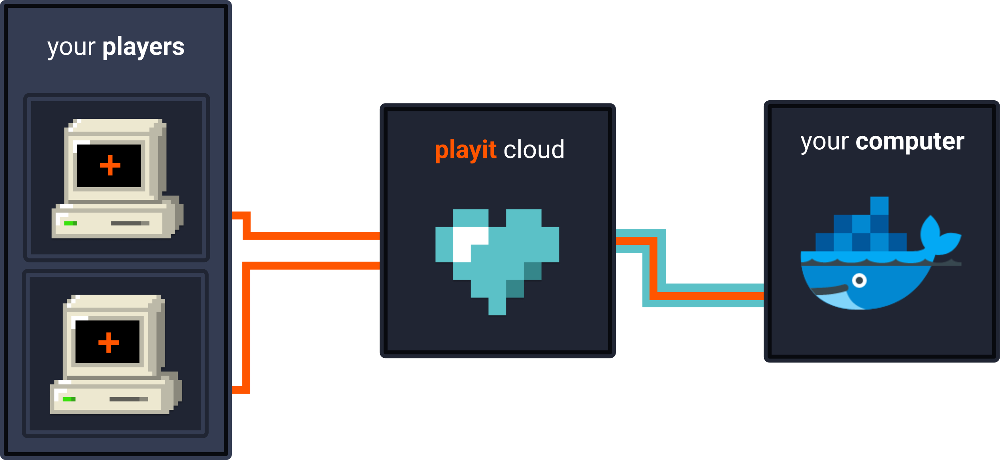

<h1>Playit Docker Images 🐳</h1>

Contains docker images for popular game servers integrated with playit to make them public.\
playit.gg is a global proxy that allows you to host a server without port forwarding. [Read more](https://playit.gg/about)

## We provide
- TCP and UDP tunneling
- Dual stacked IPv4 and IPv6 network
- Continuous port ranges
- Static IPs and ports
**All for free!** + *extra premium features* to support the project :)

## Supported Games ✅
- [satisfactory](/satisfactory/README.md)
- [scp-secret-laboratory](/scp-secret-laboratory/README.md)
- [unturned](/unturned/README.md)
- [valheim](/valheim/README.md)

## Coming-Soon™
- Minecraft Java
- Minecraft Bedrock
- Minecraft BungeeCord
- Rust

Want More? Have Any Suugisons? [Join Our Discord](https://discord.gg/AXAbujx)